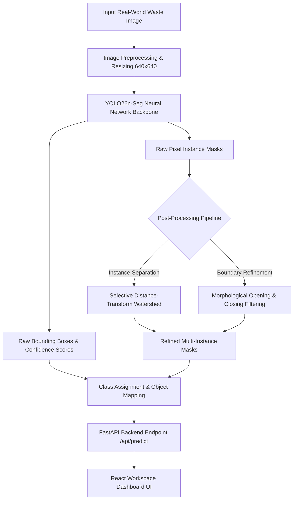
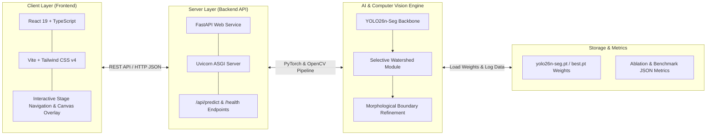
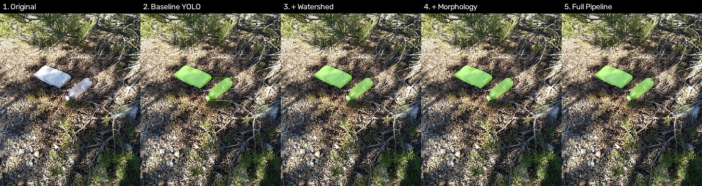
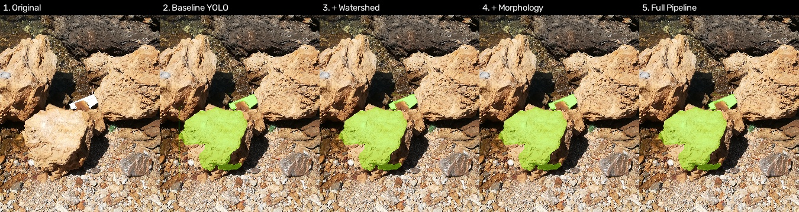

# TrashTrace — Real-World Waste Instance Segmentation

TrashTrace is an end-to-end computer vision platform designed to detect, segment, and categorize individual waste items in cluttered real-world environments.

---

## 1. Problem Statement

Global waste management and automated recycling facilities face severe operational challenges due to improper waste disposal and inefficient sorting. Automated sorting systems frequently fail when encountering complex, cluttered scenes where waste items (plastics, metals, glass, paper) are:
- Overlapping and tightly packed
- Crumpled, deformed, or fragmented
- Partially occluded by other debris or background clutter

Standard bounding-box object detection is insufficient because it cannot delineate exact object boundaries, leading to incorrect sorting decisions and machinery jams. TrashTrace solves this by generating precise pixel-level instance masks for every individual waste item.

---

## 2. Our Solution

TrashTrace combines deep neural network instance segmentation with advanced computer vision post-processing techniques to deliver high-precision waste identification:

1. **YOLO26n-Seg Deep Neural Network**: Rapidly detects waste objects and generates initial bounding boxes and candidate pixel masks.
2. **Selective Watershed Segmentation**: Separates overlapping and touching waste items that deep learning models often merge into a single mask.
3. **Morphological Boundary Refinement**: Applies mathematical morphology (opening/closing operations) to eliminate boundary noise, fill internal mask holes, and produce crisp segmentation contours.
4. **Interactive Dashboard**: A modern web interface powered by FastAPI and React for real-time visualization, stage-by-stage pipeline inspection, and analytics.

---

## 3. System Flowchart



---

## 4. System Architecture



---

## 5. Model Overview

- **Model Architecture**: YOLO26n-Seg (`yolo26n-seg.pt`)
- **Task Type**: Real-World Waste Instance Segmentation & Classification
- **Input Resolution**: 640 x 640 pixels
- **Inference Speed**: ~6.3 ms per image (~158 FPS on GPU)
- **Target Categories (5 Classes)**:
  1. `plastic` (Bottles, bags, containers, wrappers)
  2. `metal` (Cans, foil, metal lids)
  3. `paper_cardboard` (Boxes, paper cups, newspapers)
  4. `glass` (Glass bottles, jars)
  5. `other` (Organic waste, textile debris, unclassified trash)

---

## 6. Dataset Source

- **Primary Source**: TACO (Trash Annotations in Context) combined with curated real-world waste splits.
- **Dataset Composition**:
  - Total Images: **1,300 images** (1,150 train, 100 validation, 50 held-out test)
  - Total Annotated Instances: **6,072 waste instances**
- **Data Integrity & Leakage Protection**:
  - Leakage Audit: Multi-stage validation using MD5 hashing and perceptual difference hashing (`dhash`).
  - Result: 0% data leakage between training, validation, and test splits.

---

## 7. Neural Network Training & Fine-Tuning

- **Base Weights**: `yolo26n-seg.pt`
- **Fine-Tuning Duration**: 20 Epochs
- **Optimizer**: AdamW (`lr0 = 0.01`, `lrf = 0.01`)
- **Batch Size**: 4
- **Confidence Threshold**: 0.25
- **IoU Threshold**: 0.50
- **Hardware Acceleration**:
  - GPU: NVIDIA GeForce RTX 3050 6GB Laptop GPU
  - CUDA: 12.4 / PyTorch 2.6.0+cu124
  - OS: Windows 11

---

## 8. Quantitative Evaluation Scores

| Pipeline Configuration | Mean IoU Score | Description & Impact |
| :--- | :---: | :--- |
| **Baseline YOLO26n-Seg** | **0.8570** (85.70%) | Core neural network baseline output |
| **Watershed Score** *(Selective Watershed)* | **0.8357** (83.57%) | Separates merged/touching waste objects (+25 candidate regions split) |
| **Morphology Score** *(Morphological Refinement)* | **0.8606** (86.06%) | **Highest segmentation accuracy** (+0.36% Mean IoU gain over baseline) |
| **Full Pipeline Score** *(Watershed + Morphology)* | **0.8374** (83.74%) | End-to-end split & boundary refinement pipeline |

---

## 9. Sample Detection & Segmentation Results

### Result Sample 1: Multi-Object Waste Segmentation


### Result Sample 2: Overlapping Waste & Instance Separation


---

## 10. Tech Stack & Run Commands

### Tech Stack

- **Machine Learning & CV**: PyTorch 2.6, Ultralytics YOLOv8/YOLO26, OpenCV, NumPy, SciPy
- **Backend API**: Python 3.11, FastAPI, Uvicorn, Pydantic
- **Frontend Dashboard**: React 19, TypeScript, Vite, Tailwind CSS v4
- **Development Environment**: CUDA 12.4, Conda (`waste-seg`)

---

### Project Run Commands

#### 1. Setup Backend Environment

```bash
# Create and activate conda environment
conda create -n waste-seg python=3.11 -y
conda activate waste-seg

# Install PyTorch with CUDA 12.4 support
pip install torch torchvision torchaudio --index-url https://download.pytorch.org/whl/cu124

# Install backend dependencies
pip install -r server/requirements.txt
```

#### 2. Launch FastAPI Backend Server

```bash
# Run backend API server on http://localhost:8000
python server/src/app.py
```

#### 3. Setup & Launch Frontend Client

```bash
# Navigate to client directory
cd client

# Install dependencies
npm install

# Start Vite development server on http://localhost:5173
npm run dev
```

---

## 11. Team Members & Roles

| Team Member | Role & Key Responsibilities |
| :--- | :--- |
| **THIYANESH D** | **Team Lead** — Model research, ML training/fine-tuning & validation, backend development |
| **DHANUSH M** | **Data Engineering** — Data engineering, preprocessing, augmentation refining |
| **PRAVEEN J** | **Project Research** — Feature suggestions, watershed and morphology implementation |
| **ANGESH KARTHIK S** | **Product Engineering** — Frontend development and integration |
